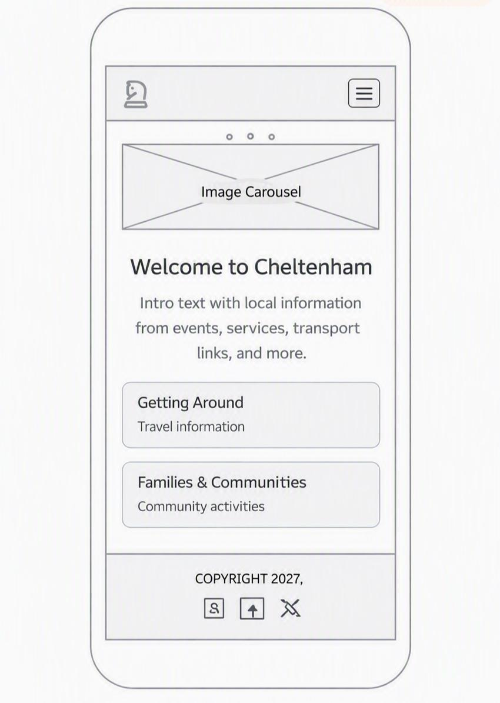
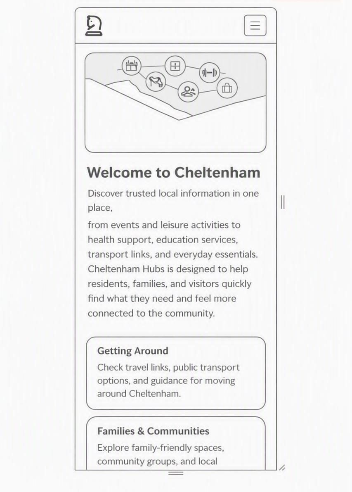

# Cheltenham Hubs
**Live Site**
https://salimjamshidi.github.io/project-1/

##  Project Overview
Cheltenham Hubs is your central guide to events, activities, and community spaces in Cheltenham. It helps locals and visitors find things to do, book sessions, and connect with what’s on in the area.

## Strategy

### Business Goals
- To make sure this site is easy for everyone to use - include people with disabilities
>**why**: Information should be available to all members of our community, no exception.
- To create **one central, trusted place** for all events, meetups, and activities across Cheltenham
> **Why**: Becasue right now people have to search 5 diffirent sites to find everything - this fixes that and makes it easy for them .
- To help local businesses, clubs, and organisers reach more people and grow their community
> **why**: Because small local groups often struggle to get noticed - this helps them connect with more people .
- To make discovering and booking things to do **simple, fast, and stress‑free** for everyone
> **why** Most people want quick answers, not complicated steps .
- To support local life and bring people together
- To help people easily find leisure centres, swimming pools, and gyms, - including their locations, openning/closing times and full list of services**
> **Why**: This is useful daily info that is hard to find all in one place.
- To provide quick access to important emergency and contact numbers: police,ambulance, hospitals, and other vital services**
**why** Because people need these numbers instantly if they ever need them - safety comes first.

### User Goals & User Stories
- **As a new visitor**, I want to see upcoming events clearly so I can plan my trip easily.
- **As a local resident**, I want to find fun things to do near me quickly, without searching lots of different sites.
- **As an event organiser**, I want to share my event details simply so people can find and attend it.
- **As someone new to the area**, I want to discover what’s on and what this town has to offer.

### Target Audience
- Local residents of all ages living in and around Cheltenham
- Tourists and visitors exploring the area
- Families, students, hobbyists, and groups looking for activities
- Local organisers, businesses, and community groups

## Scope

### Features Included
- Accessibility support button with options to adjust text size , contrast and read text loud
> **Why**: To help people with visual , reading , or motore difficulties us the site comfortably.
- Clear homepage introduction to the project
> **Why** So visitors know exactly what thois site is the momment they arrive .
- Events listing showing date, time, location, and description
> **why**: These are the four most important this peole look for .
- Fully responsive design that works perfectly on mobile, tablet, and desktop
> **why**: Over 70% people browse on phones - it must work everywhere 
- Built-in accessibility features: large clickable buttpns, clear fonts, and description for images
>**why**: follows best practice so nobody is left out.
- Simple, consistent navigation menu across all pages
- Contact details and location information
- Enquiry or booking request option for each event
- **Optional subscription plan: £3.99 per month for early access to events and priority booking**

### Features Not Included
- No user registration or login system
- No one‑off online payment processing
- No event upload or submission form for organisers
- No advanced filtering or search functions
- No live map integration

## Structure

### Site Pages
- Home
- Events & Activities
- Leisure & Facilities
- Book / Enquire
- Contact Us

### Main Navigation
- Links: Home | Events | Leisure | Book | Contact
- Same easy menu on every page
- Logo always takes you back to Home
> **Why**: So even people who are not good with computers or have disabbitly can use it easily and never get lost.

### User Journey
- Start at Home → see what’s on → browse Events or Leisure → view full details → enquire or book → get in touch if you need more info

##  Skeleton 

### Layout Principles
- Important information placed first and easy to find
- Clean, uncluttered layout on all screen sizes
- Consistent spacing, alignment, and menu position
- Buttons and links large enough for touch screens
- Content automatically adjusts for mobile, tablet, and desktop

---

## Surface & Design

### Design Choices
- **Colour Palette**: To be confirmed — will be chosen to feel welcoming, clear, and easy to read for all users.
- **Typography**: To be confirmed — will use clean, readable fonts that work well on phones, tablets, and computers.
- **Visual Style**: Simple, friendly, and organised — important information stands out clearly. Emergency numbers will be easy to spot.

### Final Design Mockups
*(To be added once design is finalised)*

### finished pics of my project
## laptop veiw 

## ipad veiw

## mobile veiw

## Wireframes

### Home Page

### Safety & Support

### Health Services

### ebveryday essentials

### Family & Community

### getting around

### Charity support services

### Education
<imag src="images/uni sections.jpeg" alt="uni" widt="700">

## Mobile wirframes

## Technologies Used
- **HTML5**: Structure and content of all pages
- **CSS3**: Styling, layout, colours, and design
- **Bootstrap 5**: Responsive grid, navigation, and ready‑made components
- **Balsamiq**: For creating wireframes during planning
- **GitHub**: Version control and storing project files
- **GitHub Pages**: To host and deploy the live website
- **VS Code**: Main code editor used to build the project

##  Credits
- Bootstrap 5 framework: https://getbootstrap.com/
- vs Code 

## 🚀 Deployment

### Running Locally
1. Go to the GitHub repository

### Live Website
Hosted using **GitHub Pages**

## 🧪 Testing

### User Story Testing

### Responsive Testing

### Validation & Checks

### Bugs & Fixes
- **Images not showing** → Fixed file paths and spelling
- **CSS not loading** → Fixed link to stylesheet in HTML
- **Mobile layout messy** → Added viewport and responsive sizing
- **Links broken** → Corrected file names and paths
- **Text hard to read** → Improved colors and contrast
